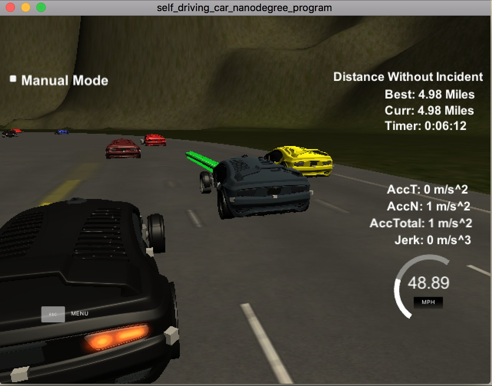
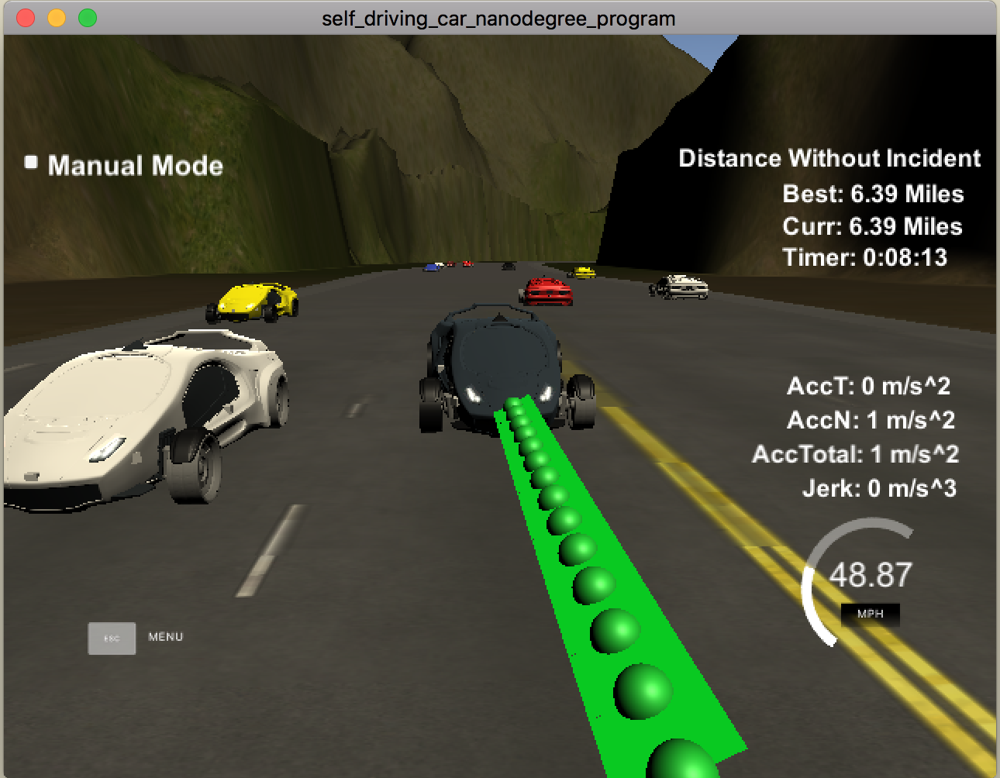

# Path Planning Project

### Introduction
The goal of this project to safely navigate around a virtual highway with other traffic that is driving +-10 MPH of the 50 MPH speed limit. The car's localization information is made available through sensor fusion data from the simulator. The car should stay with in the speed limit and the acceleration and jerk factors cannot be more than 10 m/s^2 and 10 m/s^3 respectively.

### Highway Map
A map of the highway in the simulator is provided as a CSV file `data\highway_map.csv` with each waypoint in the list containing  [x,y,s,dx,dy] values.
* `x` and `y` are the waypoint's map coordinates
* `s` value is the distance along the road in Frenet's coordinates ranging from 0 to 6945.554
* `dx` and `dy` are unit normal vector pointing outward of the highway loop.
* Also the given function `getXY` can be used to convert `s` Frenet's coordinate to XY Map coordinates

## Compile & Build Instructions

1. Clone this repo.
2. Add `spline.h` to perform Cubic Spline interpolation.
3. Make a build directory: `mkdir build && cd build`
4. Compile: `cmake .. && make`
5. Run it: `./path_planning`.

## Results & Discussion

### Prediction

Prediction is the first step in the path planning process. It involves analyzing the sensor fusion data and determine the current traffic conditions. There can be ego cars on the road possibly going at hight speeds and making close approaches. If another car/object is noticed by the sensor data in front of the car or on the rear end with in 30 meters then its considered a risk and an appropriate behavior or course of action should be determined.

In the `main.cpp` file the code from line # 276 to 304 uses the sensor fusion data effectively and determines if there are any cars in front slowing down or cars in the left or right lane. Based on the results we can either change lanes or accelerate/brake as needed.

### Behavior Planning

Using the results from previous step an appropriate behavior for the car is estimated. A change is lane is decided by the `lane` variable and a new `drive_to_speed` is obtained, code line # 306 to 331. The next step in trajectory planning will utilize this data to interpolate the new set of way points for driving the car as per the planned behavior.

### Trajectory Estimation

In general, a cost function can be designed based various factors of driving, such as collision, in-lane driving, speed-limit et., to estimate the new path. In this project, used the cubic splines library to estimate the new set of way points based on the predictions and the planned behavior for the car.

* `ln 334 to 369` - picks the last few points from the previous path returned by the simulator and 3 future waypoints. The new waypoints are also converted from map coordinates to car's local coordinates.

* `ln 371 to 408` - the new waypoints are fit using splines and a new path is estimated based on the planned speed. The new path values are pushed to the simulator using the WebSocket connection for driving/control execution.

## Conclusion

The following video shows the car running the entire course without any warning for speed, collision and maximum jerk. The car is also able to stay in the lane and accelerate or decelerate as needed. It is also capable of changing lanes when possible.

Link to a video showing the complete run [Youtube](https://youtu.be/rMQglOHh0LA)

